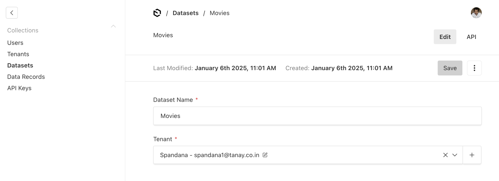
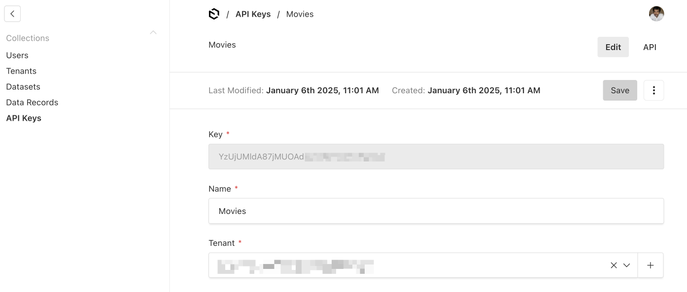
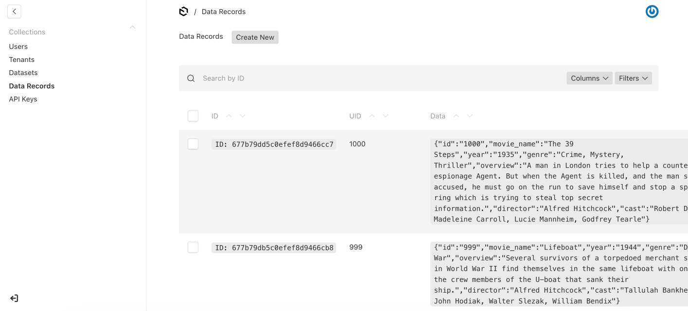

# MovieHub

MovieHub is a modern movie listing and recommendation web application built with
Next.js. It leverages RagCloud's powerful API to deliver intelligent search and
personalized movie recommendations, providing users with an enhanced browsing
experience on both web and mobile platforms.

## Table of Contents

- [Features](#features)
- [Screenshots](#screenshots)
- [Getting Started](#getting-started)
  - [Prerequisites](#prerequisites)
  - [Installation](#installation)
  - [Configuration](#configuration)
  - [Populating the Database](#populating-the-database)
- [Implementing RagCloud](#implementing-ragcloud)
  - [Registering with RagCloud](#registering-with-ragcloud)
  - [Setting Up RagCloud Dataset](#setting-up-ragcloud-dataset)
  - [Generating RagCloud API Key](#generating-ragcloud-api-key)
  - [Pushing Data to RagCloud](#pushing-data-to-ragcloud)
- [Technologies Used](#technologies-used)
- [Contributing](#contributing)
- [License](#license)

## Features

- **Intelligent Search:** Users can search for movies using keywords with
  real-time suggestions powered by RagCloud.
- **Personalized Recommendations:** Get movie recommendations based on your
  viewing preferences.
- **Responsive Design:** Optimized for both web and mobile devices.
- **Loader Indicators:** Visual feedback during data fetching enhances user
  experience.
- **Detailed Movie Information:** Comprehensive details for each movie,
  including ratings, genre, and more.
- **Demo Code Boxes:** View the requests and responses sent to RagCloud for
  educational purposes.

## Screenshots

<!-- Placeholder for Home Page Screenshot -->

### Home Page


<!-- Placeholder for Search Page Screenshot -->

### Search Page (DB Search)


### Search Page (RagCloud Search)


<!-- Placeholder for Movie Detail Page Screenshot -->

### Movie Detail Page


<!-- Placeholder for RagCloud Request/Response Screenshot -->

### RagCloud Integration

All pages show the requests and responses sent to RagCloud for educational
purposes.


## Getting Started

Follow these instructions to set up and run the project locally.

### Prerequisites

- **Node.js** (v14 or later)
- **npm** or **Yarn**
- **MongoDB** Database
- **RagCloud API Key**
- **movies.movies.json** file (included in the repository)

### Installation

1. **Clone the Repository**

   ```bash
   git clone https://github.com/your-username/moviehub.git
   cd moviehub
   ```

2. **Install Dependencies**

   Using npm:

   ```bash
   npm install
   ```

   Or using Yarn:

   ```bash
   yarn install
   ```

### Configuration

1. **Environment Variables**

   Create a `.env.local` file in the root directory and add the following
   variables:

   ```env
   MONGODB_URI=your_mongodb_connection_string
   RAGCLOUD_API_KEY=your_ragcloud_api_key
   RAGCLOUD_API_BASE_URL=https://ragcloud.io
   ```

   - **MONGODB_URI:** Your MongoDB connection string.
   - **RAGCLOUD_API_KEY:** Your RagCloud API key.
   - **RAGCLOUD_API_BASE_URL:** Base URL for RagCloud API (default is
     `https://ragcloud.io`).

2. **Next.js Configuration**

   Ensure your `next.config.js` allows images from external domains used for
   movie posters.

   ```javascript
   // next.config.js

   module.exports = {
   	images: {
   		domains: ["m.media-amazon.com"], // Add other domains as needed
   	},
   };
   ```

3. **Tailwind CSS Configuration**

   Ensure `tailwind.config.js` includes paths to your components and pages.

   ```javascript
   // tailwind.config.js

   module.exports = {
   	content: [
   		"./pages/**/*.{js,ts,jsx,tsx}",
   		"./components/**/*.{js,ts,jsx,tsx}",
   	],
   	theme: {
   		extend: {},
   	},
   	plugins: [],
   };
   ```

4. **Default Poster Image**

   Add a `default-poster.jpg` image in the `public` directory to serve as a
   fallback when a movie poster is unavailable.

### Populating the Database

1.  **Using `movies.movies.json`**

    The repository includes a `movies.movies.json` file containing sample movie
    data. You can use this file to populate your MongoDB database.

2.  **Importing Data into MongoDB**

    Use the following steps to import the JSON data into your MongoDB database:

    - **Install MongoDB Tools** (if not already installed):

      ```bash
      # For macOS using Homebrew
      brew tap mongodb/brew
      brew install mongodb-database-tools
      ```

    - **Import the JSON File:**

      ```bash
      mongoimport --uri "your_mongodb_connection_string" --collection movies --file path/to/movies.movies.json --jsonArray
      ```

      - Replace `"your_mongodb_connection_string"` with your actual MongoDB URI.
      - Ensure the `movies.movies.json` file is correctly formatted as a JSON
        array.

3.  **Run Migration Script**
    <!-- Link to "Source Data Import/mongodbinsert.js -->

        Run the migration script to insert the data into the MongoDB database.

        ```bash
        node source-data-import/mongodbinsert.js
        ```

        - **Note:** Ensure your `.env.local` file includes the necessary environment
          variables as shown above.

## Implementing RagCloud

RagCloud's API powers both the search and recommendation features of MovieHub.
Below is a guide on how to integrate RagCloud into your application.

### Registering with RagCloud

1. **Sign Up**

   - Visit [RagCloud](https://ragcloud.io/) and register for an account.

2. **Login to Admin Panel**

   - After registration, log in to the RagCloud admin panel at
     [https://ragcloud.io/admin](https://ragcloud.io/admin).

### Setting Up RagCloud Dataset

1. **Create a Dataset**

   - In the RagCloud admin panel, create a new dataset named **"Movies"**.

   <!-- Placeholder for Dataset Creation Screenshot -->

   ### Creating "Movies" Dataset

   

### Generating RagCloud API Key

1. **Create an API Key**

   - In the RagCloud admin panel, navigate to the **API Keys** section.
   - Generate a new API key and note it down. This key will be used to
     authenticate API requests.

   <!-- Placeholder for API Key Generation Screenshot -->

   ### Generating API Key

   

### Pushing Data to RagCloud

A one-time script is used to push data from MongoDB to RagCloud. Follow these
steps to execute the script.

**Migration Script**

```bash
node source-data-import/ragcloudinsert.js
```

5. **Verify Data in RagCloud**

   - Log in to the RagCloud admin panel to verify that the "Movies" dataset has
     been populated correctly.

   <!-- Image data-records.png-->

   

## Technologies Used

- **Next.js:** React framework for server-rendered applications.
- **React:** JavaScript library for building user interfaces.
- **MongoDB:** NoSQL database for storing movie data.
- **RagCloud API:** Provides intelligent search and recommendation
  functionalities.
- **Tailwind CSS:** Utility-first CSS framework for styling.
- **Axios:** Promise-based HTTP client for making API requests.

---
